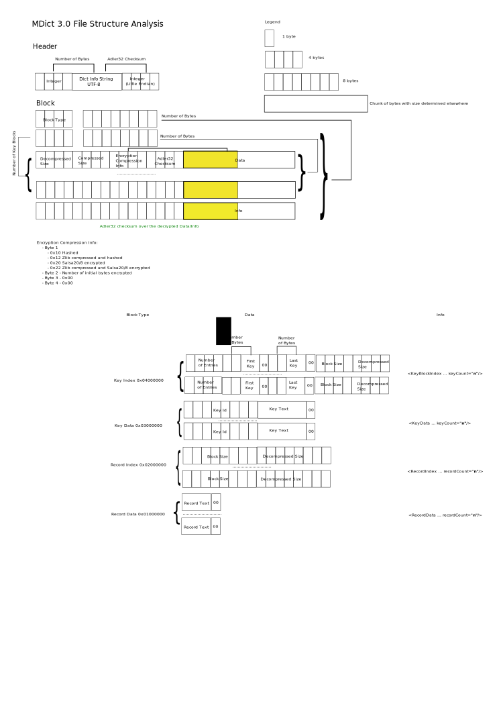

# js-mdict

[](https://badge.fury.io/js/js-mdict)
[](https://github.com/terasum/js-mdict/issues)
[](https://github.com/terasum/js-mdict/network)
[](https://github.com/terasum/js-mdict/stargazers)
[](https://github.com/terasum/js-mdict/blob/develop/LICENSE)

mdict (\*.mdd \*.mdx) file reader based on [jeka-kiselyov/mdict](https://github.com/jeka-kiselyov/mdict) .

Thanks to [fengdh](https://github.com/fengdh/mdict-js) and [jeka-kiselyov](https://github.com/jeka-kiselyov/mdict).

## Latest Version

v6.0.2 (2025-01-04)

## Usage

```bash
npm install js-mdict
```

### ESM

```javascript
import { MDX } from "js-mdict";

const mdict = new MDX("resources/oald7.mdx");

const def = mdict.lookup("ask");
console.log(def.definition);


/*
<head><link rel="stylesheet" type="text/css" href="O7.css"/></head><body><span class="hw"> ask </span hw><span class="i_g">   /<a class="i_phon" href="sound://aask_ggv_r1_oa013910.spx">ɑ:sk</a i_phon><span class="z">; </span z><i>NAmE</i> <a class="y_phon" href="sound://aask_ggx_r1_wpu01057.spx">æsk</a y_phon>​/ </span i_g><span class="cls"> verb</span cls><br><span class="sd">QUESTION<span class="chn"> 问题</span chn></span sd>
<div class="define"><span class="numb">1</span numb><span class="cf"> ~ <span class="bra">(</span bra>sb<span class="bra">)</span bra> <span class="bra">(</span bra>about sb/ sth<span class="bra">)</span bra> </span cf><span class="d">to say or write sth in the form of a question, in order to get information<span class="chn"> 问；询问</span chn></span d></div define>
<span class="phrase"><span class="pt">  [<span class="pt_inside">V <span class="pt_bold">speech</span></span><span>]</span> </span pt></span phrase>
<span class="sentence_eng">'Where are you going?' she asked. </span sentence_eng>
<span class="sentence_chi">"你去哪里？"她问道。</span sentence_chi>
<span class="phrase"><span class="pt"> [<span class="pt_inside">VN <span class="pt_bold">speech</span></span><span>]</span> </span pt></span phrase>
<span class="sentence_eng">'Are you sure?' he asked her. </span sentence_eng>
...
</body>
  */
import { MDD } from '../dist/cjs/index.js';

const mdx = new MDD('./tests/data/oale8.mdd');
console.log(mdx.locate('\\Logo.jpg'));

/*
$ git clone github.com/terasum/js-mdict
$ cd js-mdict
$ npx tsx ./example/oale8-mdd-example.ts

{
  keyText: '\\Logo.jpg',
  definition: '/9j/4AAQSkZJRgABAgAAAQABAAD//gAEKgD/4gIcSUNDX1BST0ZJTEUAAQEAAAIMbGNtcwIQ...'
 }
*/


/*

  */
```

### CommonJS

```javascript
const { MDX } = require('js-mdict');

const mdict = new MDX('resources/oald7.mdx');

const def = mdict.lookup('ask');
console.log(def.definition);

/*
<head><link rel="stylesheet" type="text/css" href="O7.css"/></head><body><span class="hw"> ask </span hw><span class="i_g">   /<a class="i_phon" href="sound://aask_ggv_r1_oa013910.spx">ɑ:sk</a i_phon><span class="z">; </span z><i>NAmE</i> <a class="y_phon" href="sound://aask_ggx_r1_wpu01057.spx">æsk</a y_phon>​/ </span i_g><span class="cls"> verb</span cls><br><span class="sd">QUESTION<span class="chn"> 问题</span chn></span sd>
<div class="define"><span class="numb">1</span numb><span class="cf"> ~ <span class="bra">(</span bra>sb<span class="bra">)</span bra> <span class="bra">(</span bra>about sb/ sth<span class="bra">)</span bra> </span cf><span class="d">to say or write sth in the form of a question, in order to get information<span class="chn"> 问；询问</span chn></span d></div define>
<span class="phrase"><span class="pt">  [<span class="pt_inside">V <span class="pt_bold">speech</span></span><span>]</span> </span pt></span phrase>
<span class="sentence_eng">'Where are you going?' she asked. </span sentence_eng>
<span class="sentence_chi">"你去哪里？"她问道。</span sentence_chi>
<span class="phrase"><span class="pt"> [<span class="pt_inside">VN <span class="pt_bold">speech</span></span><span>]</span> </span pt></span phrase>
<span class="sentence_eng">'Are you sure?' he asked her. </span sentence_eng>
...
</body>
  */
```

## Benchmark

```angular2html
Mdict#loading time: 0 sec
Mdict#lookup x 20,288 ops/sec ±0.44% (93 runs sampled)
Mdict#prefix x 3,279 ops/sec ±17.69% (92 runs sampled)
Mdict#associate x 6,436 ops/sec ±0.40% (98 runs sampled)
Mdict#loadDict
average load time:0.0522899 s
Mdict#decodeRecordBlock
average decode time:0.19147 s
```
## TESTED Dictionaries

| File Path | Title | Version | Encoding | 'arose' Definition's Length |
| --------- | ----- | ------- | -------- | --------------------------- |
|dict-01-袖珍葡汉汉葡词典(简体版).mdx|Title (No HTML code allowed)|2.0|UTF-16|181|
|dict-02-红葡汉词典.mdx|Title (No HTML code allowed)|2.0|UTF-16|135|
|dict-03-ptDict_KeyCaseSensitive.mdx|Title (No HTML code allowed)|2.0|UTF-16|207|
|new-oxford-en-ch-dict.mdx|新牛津英汉双解大词典|2.0|UTF-8|285|
|oald7.mdx|Oxford Advanced Learner&apos;s Dictionary 7th|1.2|UTF-8|220|
|oale8.mdd|OALECD8e|2.0||1513|
|oale8.mdx||2.0|UTF-8|1549|
|Collins COBUILD Advanced Learner's English-Chinese Dictionary.mdd|柯林斯高阶英汉双解学习词典|2.0||13014|
|Collins COBUILD Advanced Learner's English-Chinese Dictionary.mdx|Collins COBUILD Advanced Learner&apos;s English-Chinese Dictionary|1.2|UTF-8|495|
|Oxford Advanced Learner's Dictionary 7th.mdd|O7|2.0||2295|
|Oxford Advanced Learner's Dictionary 7th.mdx|Oxford Advanced Learner&apos;s Dictionary 7th|1.2|UTF-8|220|
|The American Heritage Dictionary of English Language.mdd|undefined|1.2|undefined|1141|
|The American Heritage Dictionary of English Language.mdx|The American Heritage Dictionary of English Language|1.2|UTF-16|1823|
|Macmillan English Dictionary.mdd|Macmillan English Dictionary|2.0||44697|
|Macmillan English Dictionary.mdx|Macmillan English Dictionary|2.0|UTF-8|517|
|Oxford Collocations Dictionary for students of English 2nd.mdd|Oxford Collocations Dictionary for students of English|2.0||43791|
|Oxford Collocations Dictionary for students of English 2nd.mdx|Oxford Collocations Dictionary for students of English|2.0|UTF-8|386|
|Oxford Dictionary of English 2005 2nd.mdx|Oxford Dictionary of English|2.0|UTF-8|1081|
|Vocabulary.com Dictionary.mdd|Vocabulary.com Dictionary|2.0||145|
|Vocabulary.com Dictionary.mdx|Vocabulary.com Dictionary|2.0|UTF-8|2501|


## Release

### v6.0.3 (2025-01-04)
1. fix tests and benchmarks

### v6.0.2

1. implements with TypeScript
2. fix some overflow bug
3. resort the keyword order internally (may cost more memory), search word precisely

BREAKING:
1. the `Mdict` class don't provide the `lookup` method now, you should use `MDX/MDD` class 

## MDX/MDD Layout
### v1.2-v2.0


> this is from [@ikey4u/wikit](https://github.com/ikey4u/wikit)

### v3.0


> this is from [xwang/mdict-analysis](https://bitbucket.org/xwang/mdict-analysis/src/master/MDict3.svg)

code by terasum with ❤️
